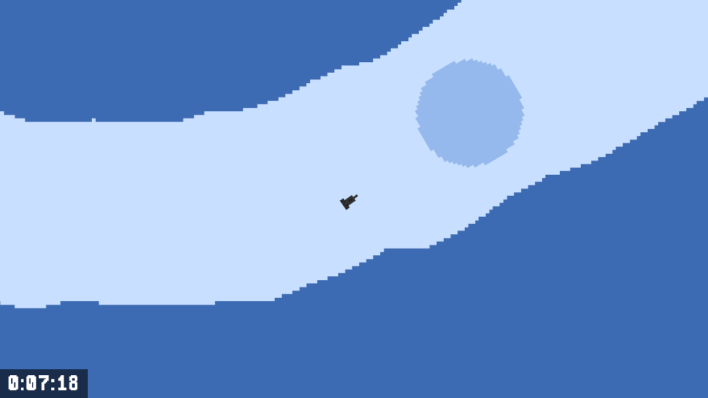

Deep Flight is an online 2D racing game, where players race against each other in their spaceships for the best time on the randomly generated tracks. The tracks are generated and made public in sets of 4, also called a ‘round’. A round lasts for 24 hours, and once it has finished, the players will be ranked based on their best times on the round’s tracks.

## Curious? See the [demo](https://www.youtube.com/watch?v=zp4QgqXr3kI&feature=youtu.be)!


## How to play

 1) Login or play as guest (guests can only play offline)
 2) Choose whether to play online or offline:
    - Select "Online Tracks" to play the current public round and  compete against other players 
    - Select "Offline Tracks" to play a pregenerated track or get a track customly generated

3) Choose a track to play

4) Play!


### Controls

_Menu_
- Arrow keys: Navigate menu options
- Escape: Go back

_Game_
- _Arrow keys_: Control the ship
- _Space:_ to accelerate
- _Escape:_ Exit to menu
- _R:_ Restart


## Installing/Running
The game is developed using MonoGame and is thus cross-platform. However, installation has only been tested on Windows and Linux (not Mac).

 1) Download the latest release [here](https://github.com/maltebp/DeepFlightGame/releases/latest/download/DeepFlight.zip) and unzip it

 2) How to run the game depends on your operating system:

    - _Windows_  
    Just double-click `DeepFlight.exe`

    - _Linux_  
    Install `mono` and run the game by running following commands from terminal in the game directory:

        ```
        sudo apt update
        sudo apt install mono-complete 
        mono DeepFlight.exe
        ```
 
    - _Mac_ __(Not tested)__  
    Expected to be the same as _Linux_

__Disclaimer__  
Due to some technical design choices, you _must_ play with one of the following screen resolutions to avoid getting an error:

| Resolutions |
| ---------- |
| 1920x1080 |
| 1600x900 |
| 1440x900 |
| 1366x768 |
| 1360x768 |
| 1280x720 |


### Login
_Note: It's not possible to create your own profile._  

_DTU Course login_  
The game uses a login API provided by the course in was developed for. This means all participants of this course can login using their credentials.  

_Guest login_  
A series of public guest login exists. All guest profiles have the same password as username.  
The following guest logins exists:

| Guest Users |
| ---------- |
| kingkong |
| muigi |
| lario |
| superman |
| shrek |
| agent47 |
| benny |
| king1337 |
| guest1-100 (guest1, guest2 etc.) |


## Development notes
This game was developed as part of 2 my courses at Technical University of Denmark:
 - _'62597 Backend Development, Operation and Distributed Systems'_
 - _'62413 Advanced Object Oriented Programming in C# and .NET'_


### Game Client
This repository contains only the game client. This was developed in _C#_, including a game framework called [_MonoGame_](https://www.monogame.net/). It was developed by me entirely, and was, at the time, my very first project in C#.

### Backend system
The games backend system was developed as part of a group project. More information about this system can be found the other repository (github.com/maltebp/DeepFlight).
